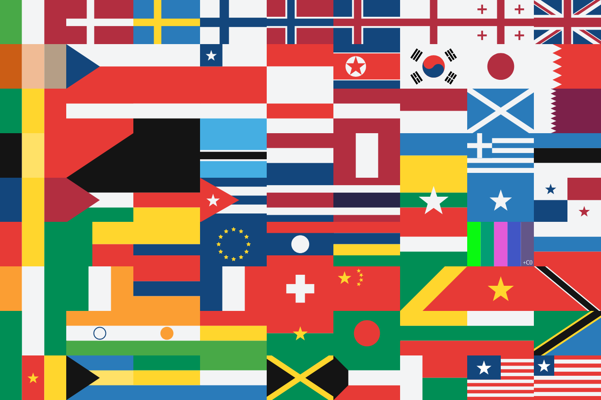

# Flags

This is a pack of flags in svg.
For simplicity (or because of laziness, some would think) I made some tweaks to complex flags.
There are different kinds of flags, partitioned by flag type.

## Image

There it is — the worst flag compilation ever:

## Optimization

Current files are fairly lightweight, but you might consider using some optimizer like [`svgo`](https://github.com/svg/svgo)

## Shape  
For the sake of consistency, all flags in `rect` folder are shaped in 2:3 proportion (non-rectangular flags retained their original form)    

## Contibuting

If you want to request a flag, fill an issue.    
Maybe at some point I will add your flag. Maybe not. Who knows. At least I'll reply.    

If you want to add a new flag (and you want to make it):
- Make sure it is a flag (not a logo/icon/photo of your dad etc.)
- Make sure your flag is known by a considerable number of people
- Make sure your flag isn't overcomplicated
- Make sure you used palette from `palette.json` *(you can skip this rule if your flag needs to be in specific colors, like Free Speech Flag)*
- If there's no suitable category for your flag, add one

Then just create a PR with your brand new flag, and that's it!
